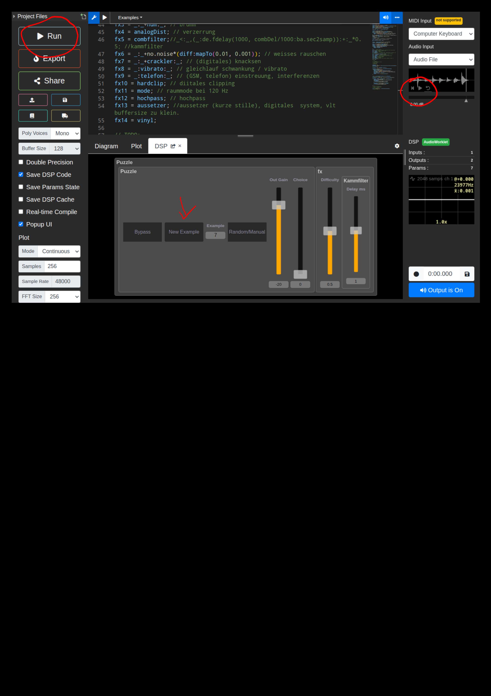

# Technisches Hören
Eine FAUST basierte 'Anwendung' um technisches hören, speziell die erkennung von 'Fehlern' in Audiomaterial zu trainiern.

## Start der Anwendung
Die Anwendung kann unter folgendem Link gestartet werden (es muss nichts installiert werden.): [HIER](https://faustide.grame.fr/?autorun=1&voices=0&name=VBL_PUZZLE&inline=aW1wb3J0KCJzdGRmYXVzdC5saWIiKTsKCmV4VHJpZyA9IGJ1dHRvbigiTmV3IEV4YW1wbGUiKTw6XyxfJzotOm1heCgwKTsKcmFuZENob2ljZSA9IG5vLm5vaXNlIDogYmEuc0FuZEgoZXhUcmlnKTpfKjAuNTpfKzAuNTpfKihudW1FeGFtcGxlcy0xKTpyb3VuZDsKbWFudWFsID0gY2hlY2tib3goIlJhbmRvbS9NYW51YWwiKTsKbWFuQ2hvaWNlID0gdnNsaWRlcigiQ2hvaWNlIiwgMCwwLDEsMC4wMSkqKG51bUV4YW1wbGVzLTEpOnJvdW5kOwpjaG9pY2UgPSByYW5kQ2hvaWNlKigxLW1hbnVhbCkgKyBtYW5DaG9pY2UqbWFudWFsOwpkaWZmID0gdnNsaWRlcigiRGlmZmljdWx0eSIsIDAuNSwgMCwxLDAuMDEpOnNpLnNtb287CgptYXBUbyhsb3dPdXQsIGhpT3V0LCB4KSA9IHgqKGhpT3V0LWxvd091dCkrbG93T3V0OyAKCmNyYWNrbGVyID0gbm8uc3BhcnNlX25vaXNlKDQuMCk7CnZpYnJhdG8gPSBkZS5mZGVsYXkoMTAwMCwgKG9zLm9zYygxKSsxKSooZGlmZjptYXBUbygzMDAsNTApKSk7Cmh1bSA9IG9zLm9zYyg1MCkqKG9zLnBoYXNvcigxLDUwKTwwLjEpKihkaWZmOm1hcFRvKDAuMDAzLCAwLjAwMSkpOwpjb21iZmlsdGVyID0gaGdyb3VwKCJLYW1tZmlsdGVyIiwgY29tYikgd2l0aCB7CiAgICBjb21iRGVsID0gdnNsaWRlcigiRGVsYXkgbXMgW3NjYWxlOmxvZ10iLCAxLCAwLjAwMSwgMzAwLCAwLjAxKTpzaS5zbW9vOwogICAgY29tYiA9IF88Ol8sKF86ZGUuZmRlbGF5KDEwMDAsIGNvbWJEZWwvMTAwMDpiYS5zZWMyc2FtcCkpOis6XyowLjU7Cn07CmdzbSA9IG9zLm9zYygxNTApKmFtcDpfKjcwOm1hLnRhbmg6XyooMStvcy5vc2MoNzUpKjAuNyk6ZmkuaGlnaHBhc3MoMyw0MDApOmZpLmxvd3Bhc3MoMSwzMDAwKTpnc21Db21iIHdpdGggewpnc21Db21iID0gXzw6XyxfOl8tZGUuZmRlbGF5KDEwMDAsIDEvMTgwMDpiYS5zZWMyc2FtcCk7ClQgPSAwLjQ1Oy8vc2VjCnQgPSBvcy5waGFzb3IoMSwxL1QpKlQ7CnNob3J0QnVyc3RzID0gKHQ8MC4wMikgKyAodD4wLjE1KSoodDwwLjE3KSArICh0PjAuMjIpKih0PDAuMjQpOwoKc2VxdWUgPSAob3MucGhhc29yKDEsMS84KT4wLjcpICogKG9zLnBoYXNvcigxLDkpPDAuOSk7CmFtcCA9IHNob3J0QnVyc3RzKigxLXNlcXVlKSArIHNlcXVlOwp9OwoKdGVsZWZvbiA9IF8rKGdzbSpkaWZmOm1hcFRvKDAuMDIsMC4wOCkgKyBuby5ub2lzZSowLjAwNTEpOwpoYXJkY2xpcCA9IF8qKGRpZmY6bWFwVG8oMiw0KSk6bWluKF8sMSk6bWF4KF8sLTEpOwoKbW9kZSA9IF88Ol8rZmkucmVzb25icCgxMjAsIDM1MCxkaWZmOm1hcFRvKDEwLDMwKSk7CmhvY2hwYXNzID0gZmkuaGlnaHBhc3MoMyxkaWZmOm1hcFRvKDE5MDAsMTAwKSk7CmF1c3NldHplciA9IF8qKG5vLnNwYXJzZV9ub2lzZSgxMC4wKTphYnM6ZmkubG93cGFzcygxLDEpKjEwPDAuMDAxNSk7CnRpZWZwYXNzID0gZmkubG93cGFzcygzLGRpZmY6bWFwVG8oMjAwLDM4MDApKTsKYW5hbG9nRGlzdCA9IF8qcHJlR2FpbjptYS50YW5oOl8qcG9zdEdhaW4gd2l0aHsKICAgIHByZUdhaW4gPSAoZGlmZjptYXBUbygyLDE4KSk7CiAgICBwb3N0R2FpbiA9IDEvcHJlR2FpbjsKfTsKCmZ4MCA9IF87IC8vIGJ5cGFzcywgb3JpZ2luYWwuIApmeDEgPSBfOyAvLyBwaGFzZSBnZWRyZWh0IGxpbmtzL3JlY2h0cy4gKGdlc2NoaWVodCBuaWNodCBpbiBkaWVzZXIgemVpbGUpCmZ4MiA9IHRpZWZwYXNzOyAvLyB0aWVmcGFzcywgbG93cGFzcywgaGljdXQKZngzID0gXzpfK2h1bTpfOyAvLyBicnVtbSAKZng0ID0gYW5hbG9nRGlzdDsgLy8gdmVyemVycnVuZwpmeDUgPSBjb21iZmlsdGVyOy8vXzw6XywoXzpkZS5mZGVsYXkoMTAwMCwgY29tYkRlbC8xMDAwOmJhLnNlYzJzYW1wKSk6KzpfKjAuNTsgLy9rYW1tZmlsdGVyCmZ4NiA9IF86Xytuby5ub2lzZSooZGlmZjptYXBUbygwLjAxLCAwLjAwMSkpOyAvLyB3ZWlzc2VzIHJhdXNjaGVuCmZ4NyA9IF86XytjcmFja2xlcjpfOyAvLyAoZGlnaXRhbGVzKSBrbmFja3NlbgpmeDggPSBfOnZpYnJhdG86XzsgLy8gZ2xlaWNobGF1ZiBzY2h3YW5rdW5nIC8gdmlicmF0bwpmeDkgPSBfOnRlbGVmb246XzsgLy8gKEdTTSwgdGVsZWZvbikgZWluc3RyZXV1bmcsIGludGVyZmVyZW56ZW4KZngxMCA9IGhhcmRjbGlwOyAvLyBkaWl0YWxlcyBjbGlwcGluZwpmeDExID0gbW9kZTsgLy8gcmF1bW1vZGUgYmVpIDEyMCBIegpmeDEyID0gaG9jaHBhc3M7IC8vIGhvY2hwYXNzCmZ4MTMgPSBhdXNzZXR6ZXI7IC8vYXVzc2V0emVyIChrdXJ6ZSBzdGlsbGUpLCBkaWdpdGFsZXMgIHN5c3RlbSwgdmx0IGJ1ZmZlcnNpemUgenUga2xlaW4uCmZ4MTQgPSB2aW55bDsKCi8vIFRPRE86Ci8vIGwvciBpbmJhbGFuY2UKLy8gc3IgcmVkdWN0aW9uIG9obmUgYWEgZmlsdGVyCi8vIG1vbm8gdnMgc3RlcmVvCi8vIGNvbXByZXNzaW9uPwovLyBwZWFrIGVxL2JlbGw_CgpudW1FeGFtcGxlcyA9IDE1OwpmeENvbGxlY3Rpb24gPSBoZ3JvdXAoImZ4IiwoZngwLGZ4MSxmeDIsZngzLGZ4NCxmeDUsZng2LGZ4NyxmeDgsZng5LGZ4MTAsZngxMSxmeDEyLCBmeDEzLGZ4MTQpKTsKCnN3aXRjaGVyKHMpID0gcGFyKGksIG51bUV4YW1wbGVzLCAqKHM9PWkpKTo-XzsKCnN3aXRjaGVyR3VpID0gdmdyb3VwKCJbMF1QdXp6bGUiLCBzd2l0Y2hlck1lY2hhbmlzbShjaG9pY2VTaWcpOl8qYW1wOnRvU3RlcmVvOnN0ZXJlb0Z4KSB3aXRoIHsKICAgIGJ5cGFzcyA9IGNoZWNrYm94KCJCeXBhc3MiKTsKICAgIGNob2ljZVNpZyA9IGNob2ljZTw6YXR0YWNoKF8sY2hvaWNlRGlzcGxheSkqKDEtYnlwYXNzKTsKICAgIGNob2ljZURpc3BsYXkgPSB2YmFyZ3JhcGgoIkV4YW1wbGVbc3R5bGU6bnVtZXJpY2FsXSIsMCw1KTsKICAgIGFtcCA9IHZzbGlkZXIoIk91dCBHYWluIiwgLTIwLCAtOTksMCwgMC4xKTpzaS5zbW9vOmJhLGJhLmRiMmxpbmVhcjsKICAgIHN3aXRjaGVyTWVjaGFuaXNtKHgpID0gc3dpdGNoZXIoeCk7CiAgICB0b1N0ZXJlbyA9IF88Ol8sXzsKICAgIHN0ZXJlb0Z4ID0gXywoXzw6XyxfKi0xOnNlbGVjdDIoY2hvaWNlU2lnPT0xKSk7Cn07CgoKdmlueWwgPSAoXyt2aW55bFNvdW5kcyooZGlmZjptYXBUbyg0LDAuNSkpKTpwaXRjaE1vZHVsYXRvcjsKLy8gNDVycG0gVmlueWwgLT4gMC43NUh6ICAKcGl0Y2hNb2R1bGF0b3IgPSBkZS5mZGVsYXkoMTAwMCwgKG9zLm9zYygwLjc1KSsxKSooZGlmZjptYXBUbyg0MCwxMCkpKTsKCnZpbnlsU291bmRzID0gdmluTm9pc2UgKyB2aW5IaUNyYWNrbGUqMC4yICsgdmluTG9DcmFja2xlIHdpdGh7CiAgICB2aW5Ob2lzZSA9IG5vLnBpbmtfbm9pc2UqMC4wMDU7CiAgICB2aW5IaUNyYWNrbGUgPSBuby5zcGFyc2Vfbm9pc2UoNC4wKStuby5zcGFyc2Vfbm9pc2UoOC4wKSowLjEyNTpjcmFja2xlUmVzSGk7CiAgICBjcmFja2xlUmVzSGkoeCkgPSB4OmZpLnJlc29uYnAoZmMsIDEsIDEpIHdpdGh7CiAgICAgICAgZmMgPSBuby5ub2lzZSo0MDAwOmJhLnNBbmRIKHg%2BMC4wMSkrNDA1MDsKICAgIH07CiAgICB2aW5Mb0NyYWNrbGUgPSBuby5zcGFyc2Vfbm9pc2UoMS4wKTpjcmFja2xlUmVzTG87CiAgICBjcmFja2xlUmVzTG8oeCkgPSB4OmZpLnJlc29uYnAoZmMsIDIsIDMpIHdpdGh7CiAgICAgICAgZmMgPSBuby5ub2lzZSo1MDpiYS5zQW5kSCh4PjAuMDEpKzU1OwogICAgfTsKfSA7Ci8vIHByb2Nlc3MgPSBoYXJkY2xpcDw6XyxfOwovLyBwcm9jZXNzID0gbm8ubm9pc2U6Z3NtQ29tYjsKLy8gcHJvY2VzcyA9IGhvY2hwYXNzPDpfLF87Ci8vIHByb2Nlc3MgPSBhdXNzZXR6ZXI7CnByb2Nlc3MgPSBoZ3JvdXAoIlB1enpsZSIsIF88OmZ4Q29sbGVjdGlvbjpzd2l0Y2hlckd1aSk7Ci8vIHByb2Nlc3MgPSB2aW55bDw6XyxfOw%3D%3D)

Auf dieser Seite muss dann der grosse "Run" geklickt werden. Weiters findet man rechts einen kleinen player, er kann verwendet werden um ein beliebiges sample zu loopen und durch den störungsgenerator zu schicken.
## Weitere Erklärungen

Die grundanwendung der besteht darin den grossen "New Example" knopf zu drücken und zuzuhören. Wenn man glaubt einen effekt erkannt zu haben kann man die Zahl bei der "Example" steht betrachten. Hier findet man zum Beispiel '4'. Man geht nun zum code, zu den definitionen der Effekte, beginnend in Zeile 41. Hier findet man 'fx4': `fx4 = analogDist; // verzerrung` also eine Verzerrung.

Nun clickt man weiter "New Example" und hofft dass man alles richtig erkennt.

Der 'Difficulty' Regler verstellt gewisse parameter die die schwierigkeit der beispiele reguliert (zum Beispiel die Lautstärke eines hinzugefügten Rauschens). Difficulty=1 bedeutet sehr schwierig, difficulty=0 sehr leicht.

